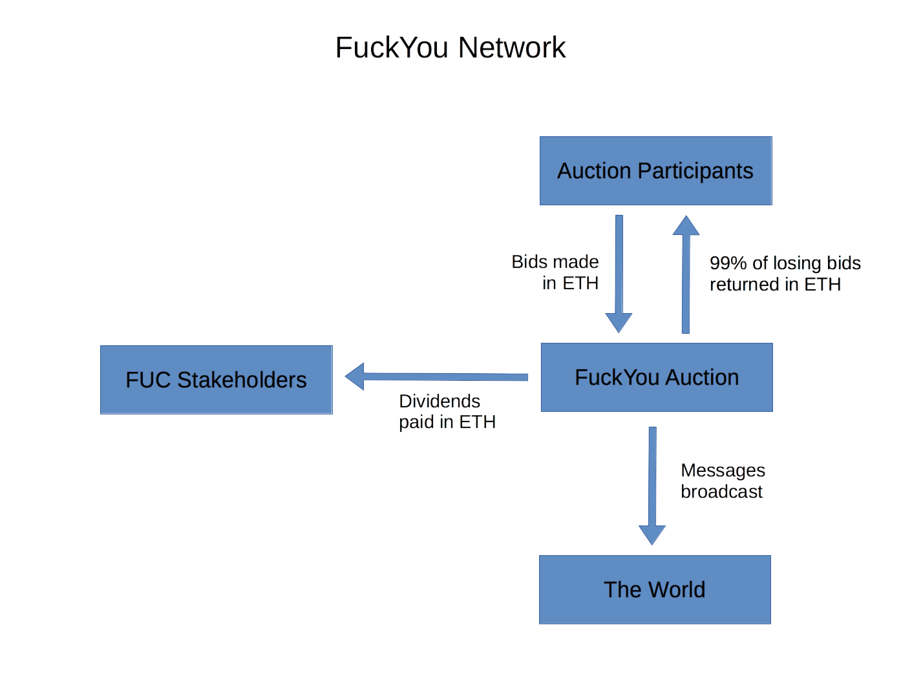
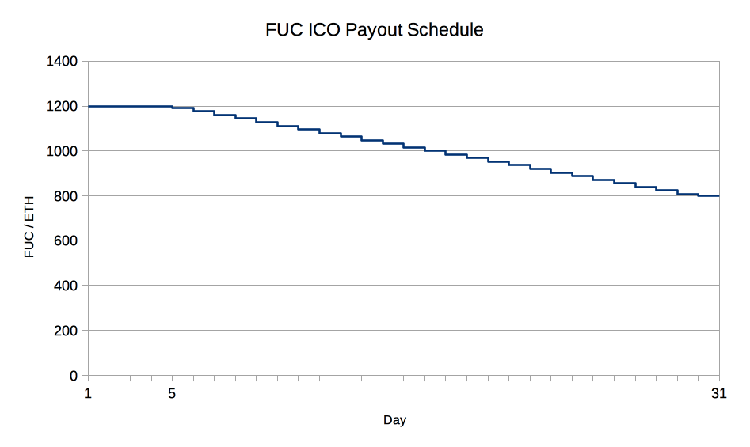

# Fuck You Dot Eth

### A daily auction and dividend-paying coin

## Abstract

We propose a means of monetizing societal rage; a daily, recurring auction
allowing participants to voice their angry opinions.
A simple, ascending-price auction is held daily, and the winner is given
a platform to broadcast the message of their choosing via a high-profile
channel. Proceeds from the auction are paid out to coin-holders
as a daily dividend.

## Motivation

Marshall McLuhan postulated that "all forms of violence are quests for
identity".
When we, as humans, feel our identities threatened,
we instinctively lash out to reassert our sense of selves.

In modern times, the means of asserting our agency has branched out from
mainly physical forms of demonstration, to mainly the realm of the verbal.
Not only is it more resource efficient to use verbal communication to
assert ourselves, its often more effective.

In the social media era, everyone has been given an online presence.
The proliferation of content-generation tools has
made it easier than ever to send messages out with a global reach.
Unfortunately, a sea of content propagated, thus making it nearly impossible to have messages actually heard over the cacophony of voices. There is simply too much noise in proportion to any one person's signal.

What is left is a burning desire for individuals to be heard, on a high-profile channel.
And in our global village, where opinions naturally differ
and abrasive situations present themselves,
people desire a platform to say.... fuck you.

## Overview of FuckYouDotEth

The FuckYou network is centered around a daily auction for exclusive digital
real estate. Participants bid for access to the FuckYouDotEth homepage and
associated message distribution channels. We anticipate FuckYouDotEth to become the
frontpage fuck-you of the internet.

The FuckYou system is designed to overcome roadblocks that naturally occur in other social media platforms. Ideas shared online are picked up only if they are popular and gain support from a bandwagon of online users. The FuckYou network allows the user to compete to have their ideas or personal "fuck you's" be heard even if they are unnpopular or completely novel. Users will be able to post these opinions in complete pseudonymity. These messages will be able to be embedded and spread across a multitude of systems making sure that the message is actually heard. The pseudonymity and online presence will allow the platform to be used for anything ranging from general rage to whistleblowing.

## Auction Details

Each auction has a bidding time of one day (86400 seconds). During that time,
bids (in ETH) with attached messages can be submitted, with only higher bids
being accepted over time. Once the auction time is expired and the auction is reset,
the winning bid and message is published on the home page.

Losing bidders can retrieve 99% of their bids. The winning bid is
collected in its entirety. All collected ether proceeds get paid as dividends, on-demand,
to FuckYouCoin (FUC) holders.

## Roadmap Features

- **Historical Auction View** - A way to easily access previous auction results
through the FuckYou website. This view will make winning auctions much more
valuable, as participants' messages will be accessible and enshrined on the FuckYouDotEth site
forever.

- **Twitter Bot** - A public Twitter account tweeting all action from the
FuckYou network, as well as software to run your own bot. This will allow
participants' messages to reach a much wider audience through a means-tested
platform. Having public bot software also allows messages to continue to be
broadcast even in the event of Twitter censorship against the official
FuckYouDotEth account.

- **Public API** - A public REST API to interact with the FuckYou network, as
well as software to run your own API service. A public API paves the way for
traditional web apps to access the FuckYou network without needing specialized
Ethereum software.

- **Mobile Apps** - Android and iOS apps to interact with the FuckYou network where you will be able to make bids, view the FuckYou of the day, view previous FuckYou winners, and make donations to the different FuckYou winners.

- **Tor Hidden Service** - A publicly accessible Tor hidden service website for
accessing the FuckYou API and website. This opens the doors for use of the
FuckYou network for whistleblower and leaker applications. Any users desiring to
remain anonymous can use our Tor hidden service to do so.

## Crowdfunding

Since the project runs entirely on Ethereum, the token creation process will be
organized entirely by smart contracts on its network.
Participants willing to buy FuckYouCoins (FUCs) can do so by sending
ether to the designated address.
By doing so, they create FUCs at a rate of between 1200 to 800 FUCs per 1 ETH.

The crowdfunding will take place over the course of 30 days, starting after 2
weeks of the FuckYou network's operation.
Early ICO participants will receive 1200 FUCs per 1 ETH for the first 5 days
(where a day = 4800 blocks) of the crowdsale, and for the next 25 days, the rate
will drop by 16 FUC/ETH daily until it reaches 800 FUC/ETH for the final day of
the ICO.

### Crowdfunding Summary

| | |
| --- | --- |
| FUC created per 1 ETH                     | 1200-800 FUC        |
| Maximum ETH                               | 10 000 ETH          |
| % of tokens for crowdfunding participants | 80%                 |
| % of tokens for FUC team                  | 20%                 |
| Approximate date of start                 | 01-07-2017, 1pm GMT |
| Approximate date of end                   | 01-08-2017, 1pm GMT |
| Maximum number of FUC created             | 14 400 000 FUC      |
| - for crowdfunding participants           | 12 000 000 FUC      |
| - for FUC team                            |  2 200 000 FUC      |

## Auction Contract Details

All collected ether proceeds from the auction process are paid into a
beneficiary account. The beneficiary, the FuckYouCoin contract, can (if this is something that is automatically done, or something to be done everytime? If so get rid of "can"/add s to withdraw) withdraw all
beneficiary funds into its own account.
The coin contract, in turn, divvies out all funds sent to it to the coinholders.

There are three main functions that users of the auction will use: `bid`,
`resetAuction`, and `withdraw`.

#### Bidding

When a participant creates a bid, all elements of the bid are required upfront,
including their message to publish, with all elements being encoded at
the time of bid, rather than at a later stage.
A `bid` in the FuckYouAuction consists of a `bidder`, `amount`,
`donationAddress`, and `message`.
The `bidder` is the address of the participant, the `amount` is the total number
of wei (the smallest denomination of ether) to bid, the `donationAddress` is an Ethereum address to be published upon
winning the auction, the `message` is, at the UI level, a 128 byte length UTF-8
string, at the contract level, 4 32 byte UTF-8 strings to also be published upon
winning the auction.

#### Resetting the Auction

When the auction time has expired, the auction becomes open for reset.
The auction then requires an explicit `resetAuction` call or a new `bid`.
In this case, the `bid` call will perform an implicit `resetAuction`.

#### Withdrawing Losing Bids

Whenever an auction participant is outbid with a higher amount, the participant
is able to retrieve 99% of their losing bid through a `withdraw` call. The 1%
remaining is added to the beneficiary fund.

#### Donations

When making a bid, an auction participant can include an optional donation address. If the participant wins the bid, the donation address is included. The donation address can be used by others to easily donate ETH or any other token.

## Coin Contract

The FuckYouCoin(FUC) contract handles ERC20 coin functions, accrual and dispersal of dividends, and the management of the ICO process.

#### Dispersing Auction Funds

The `disperseFunds` function must be called to disperse any funds accrued and not yet dispersed. Once dispersed, any token holder may call `withdrawDividends` to deposit their ETH dividends into their account.

#### ICO

Once the ICO begins, participants can call the `create` function, along with an ETH amount, to create and receive FUCs at a rate defined by `tokensPerEther`. FUC balances are frozen and cannot be traded until the ICO is completed.

## Web and Desktop Clients

We recommend using Mist, Parity, or Metamask for connecting to FuckYouDotEth.
